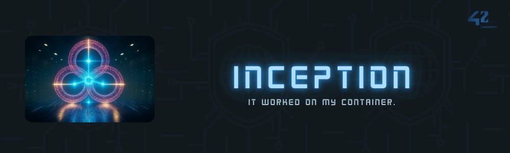

<br>

---

<br>

<details>
<summary>FRENCH VERSION</summary>

<br>

## 📚 Sommaire

- [🎯 Objectif du projet](#🎯-objectif-du-projet)
- [🛠️ Stack technique](#🛠️-stack-technique)
- [📦 Arborescence du projet](#📦-arborescence-du-projet)
- [💡 Concepts abordés](#💡-concepts-abordés)
- [🔧 Configuration & environnement](#🔧-configuration--environnement)
- [🚀 Instructions de déploiement](#🚀-instructions-de-déploiement)
- [🧪 Vérifications et outils Makefile](#🧪-vérifications-et-outils-makefile)
- [📸 Aperçu (captures)](#📸-aperçu-captures)
- [🧠 Liens utiles](#🧠-liens-utiles)
- [📜 Licence](#📜-licence)

---

## 🎯 Objectif du projet

Mettre en place une infrastructure de type production :

- Entièrement déployée à l’aide de **Docker** et **docker-compose**.
- Sécurisée via **NGINX + TLS v1.2/1.3** (port 443 uniquement exposé).
- Composée de **conteneurs personnalisés** pour chaque service (WordPress, MariaDB, NGINX).
- Avec **volumes persistants bindés** pour la base de données et le site WordPress.
- Sans aucune image préconstruite sauf Debian/Alpine.

---

## 🛠️ Stack technique

| Service     | Détails techniques                                                    |
|-------------|------------------------------------------------------------------------|
| **NGINX**   | Serveur web sécurisé (TLSv1.2/1.3), redirigeant vers WordPress via FastCGI |
| **WordPress** | Conteneur PHP-FPM + installation CLI, sans serveur HTTP intégré       |
| **MariaDB** | Base de données SQL, initialisation via script                        |
| **Volumes** | `mariadb_v`, `wordpress_v` → bind mounts vers `/home/xvi/data/...`    |
| **Env. vars** | Configuration centralisée via `.env` privé                          |
| **Makefile** | Centralise les commandes de gestion Docker (`run`, `build`, `status`) |

---

## 📦 Arborescence du projet

```
├── Makefile
└── sources
	├── docker-compose.yml
	└── requirements
		├── mariadb/
		│   ├── Dockerfile
		│   ├── conf/50-server.cnf
		│   └── tools/start_mariadb.sh
		├── nginx/
		│   ├── Dockerfile
		│   ├── conf/nginx.conf
		│   └── tools/start_nginx.sh
		└── wordpress/
			├── Dockerfile
			├── conf/www.conf
			└── tools/start_wordpress.sh
```

---

## 💡 Concepts abordés

- 🔐 **TLS avancé** (certificats auto-signés, protocoles modernes)
- 🐳 **Isolation stricte** des services via `docker-compose` + réseau bridge
- 🛠️ **Bootstrap MariaDB & WordPress** via scripts shell
- 📁 **Volumes bindés** manuellement pour garantir la persistance
- 🧪 **Robustesse des services** (`restart: on-failure`)
- 🧼 Respect de la **philosophie Unix & best practices Docker**

---

## 🔧 Configuration & environnement

- Le fichier `.env` est copié dans `sources/.env` au premier `make prepare`.
- Volumes bindés :
  - `/home/xvi/data/mariadb` → MariaDB
  - `/home/xvi/data/wordpress` → WordPress

Extrait `.env` (non inclus dans le repo) :
```
MD_ROOT_PASS=...
MD_DATA_NAME=...
MD_USER_NAME=...
MD_USER_PASS=...
WP_NAME=...
WP_ADMN_NAME=...
WP_ADMN_PASS=...
WP_ADMN_MAIL=...
WP_USER_NAME=...
WP_USER_MAIL=...
WP_USER_PASS=...
DOMAIN_NAME=...
WP_HOST=...
```

---

## 🚀 Instructions de déploiement

### Lancement des services :
```bash
make run
```

### Mode daemon :
```bash
make run-daemon
```

### Arrêt :
```bash
make stop
```

### Reconstruction :
```bash
make re
```

---

## 🧪 Vérifications et outils Makefile

### Statut :
```bash
make status
```

### Nettoyage :
```bash
make clean       # Conteneurs uniquement
make fclean      # Volumes + containers + prune
make delete-volumes
make delete-networks
```

---

## 🧠 Liens utiles

- [Docker Official Docs](https://docs.docker.com/)
- [WordPress CLI Reference](https://developer.wordpress.org/cli/commands/)
- [TLS Config Generator (Mozilla)](https://ssl-config.mozilla.org/)
- [MariaDB Configuration](https://mariadb.com/kb/en/configuring-mariadb-with-option-files/)

---

## 📜 Licence

Projet réalisé dans le cadre du cursus 42 Lausanne.  
Distribué sous [42 Unlicense](./LICENSE)

---

</details>

<br>

---

<br>

<details>
<summary>ENGLISH VERSION</summary>

<br>

## 📚 Table of Contents

- [🎯 Project Objective](#🎯-project-objective)
- [🛠️ Technical Stack](#🛠️-technical-stack)
- [📦 Project Structure](#📦-project-structure)
- [💡 Key Concepts](#💡-key-concepts)
- [🔧 Configuration & Environment](#🔧-configuration--environment)
- [🚀 Deployment Instructions](#🚀-deployment-instructions)
- [🧪 Makefile Tools & Checks](#🧪-makefile-tools--checks)
- [📸 Preview (Screenshots)](#📸-preview-screenshots)
- [🧠 Useful Links](#🧠-useful-links)
- [📜 License](#📜-license)

---

## 🎯 Project Objective

Set up a production-like infrastructure:

- Fully deployed using **Docker** and **docker-compose**.
- Secured via **NGINX + TLS v1.2/1.3** (only port 443 exposed).
- Composed of **custom containers** for each service (WordPress, MariaDB, NGINX).
- With **persistent bind-mounted volumes** for the database and WordPress site.
- Without any pre-built images except Debian/Alpine.

---

## 🛠️ Technical Stack

| Service     | Technical Details                                                     |
|-------------|------------------------------------------------------------------------|
| **NGINX**   | Secure web server (TLSv1.2/1.3), redirecting to WordPress via FastCGI |
| **WordPress** | PHP-FPM container + CLI installation, no built-in HTTP server        |
| **MariaDB** | SQL database, initialized via script                                  |
| **Volumes** | `mariadb_v`, `wordpress_v` → bind mounts to `/home/xvi/data/...`      |
| **Env. vars** | Centralized configuration via private `.env` file                   |
| **Makefile** | Centralizes Docker management commands (`run`, `build`, `status`)    |

---

## 📦 Project Structure

```
├── Makefile
└── sources
	├── docker-compose.yml
	└── requirements
		├── mariadb/
		│   ├── Dockerfile
		│   ├── conf/50-server.cnf
		│   └── tools/start_mariadb.sh
		├── nginx/
		│   ├── Dockerfile
		│   ├── conf/nginx.conf
		│   └── tools/start_nginx.sh
		└── wordpress/
			├── Dockerfile
			├── conf/www.conf
			└── tools/start_wordpress.sh
```

---

## 💡 Key Concepts

- 🔐 **Advanced TLS** (self-signed certificates, modern protocols)
- 🐳 **Strict service isolation** via `docker-compose` + bridge network
- 🛠️ **MariaDB & WordPress bootstrapping** via shell scripts
- 📁 **Manually bind-mounted volumes** to ensure persistence
- 🧪 **Service robustness** (`restart: on-failure`)
- 🧼 Adherence to **Unix philosophy & Docker best practices**

---

## 🔧 Configuration & Environment

- The `.env` file is copied to `sources/.env` on the first `make prepare`.
- Bind-mounted volumes:
  - `/home/xvi/data/mariadb` → MariaDB
  - `/home/xvi/data/wordpress` → WordPress

Sample `.env` file (not included in the repo):
```
MD_ROOT_PASS=...
MD_DATA_NAME=...
MD_USER_NAME=...
MD_USER_PASS=...
WP_NAME=...
WP_ADMN_NAME=...
WP_ADMN_PASS=...
WP_ADMN_MAIL=...
WP_USER_NAME=...
WP_USER_MAIL=...
WP_USER_PASS=...
DOMAIN_NAME=...
WP_HOST=...
```

---

## 🚀 Deployment Instructions

### Start services:
```bash
make run
```

### Daemon mode:
```bash
make run-daemon
```

### Stop services:
```bash
make stop
```

### Rebuild:
```bash
make re
```

---

## 🧪 Makefile Tools & Checks

### Status:
```bash
make status
```

### Cleanup:
```bash
make clean       # Containers only
make fclean      # Volumes + containers + prune
make delete-volumes
make delete-networks
```

---

## 🧠 Useful Links

- [Docker Official Docs](https://docs.docker.com/)
- [WordPress CLI Reference](https://developer.wordpress.org/cli/commands/)
- [TLS Config Generator (Mozilla)](https://ssl-config.mozilla.org/)
- [MariaDB Configuration](https://mariadb.com/kb/en/configuring-mariadb-with-option-files/)

---

## 📜 License

Project created as part of the 42 Lausanne curriculum.  
Distributed under [42 Unlicense](./LICENSE)

---

</details>